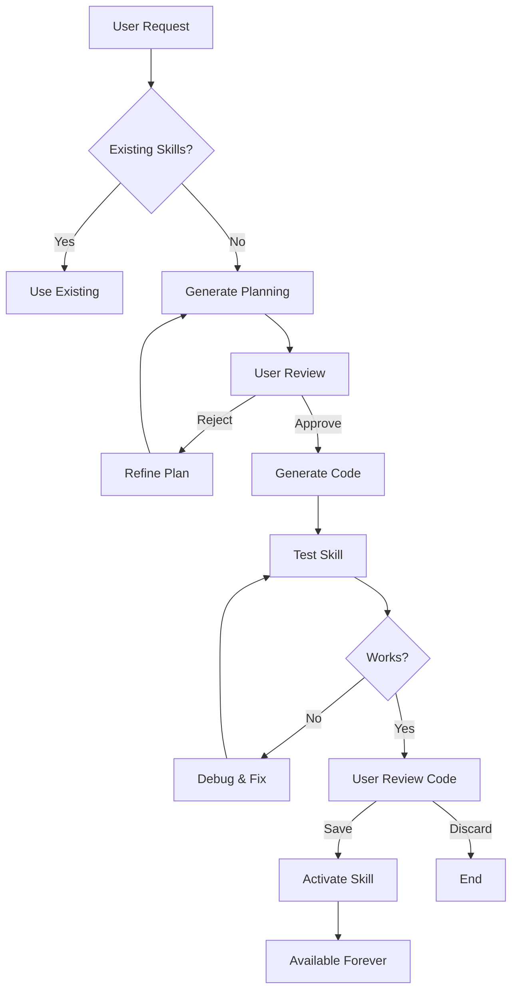

# Skill Generator (Self-Evolution System)

## 🚀 Revolutionary Feature

This is a **meta-skill** that allows the AI agent to **evolve itself** by creating new skills when needed!

## When to use this skill

Use when:
- User requests functionality not covered by existing skills
- New blockchain features need to be supported
- Custom analysis or automation is needed
- Extending the agent's capabilities

## How It Works

### Phase 1: Needs Analysis
```
User: "我想查询NFT的交易记录"
Agent: 🤔 Analyzing request...
       Current skills: ❌ No NFT skill found
       → Triggering Skill Generator
```

### Phase 2: Planning Generation
```
Agent generates planning:

📋 New Skill Plan: "nft-transaction-tracker"
━━━━━━━━━━━━━━━━━━━━━━━━━━━━━━━━

Purpose: Track NFT transactions and ownership history

Key Features:
  1. Query NFT transfer events
  2. Get NFT ownership history
  3. Calculate NFT floor price
  4. Detect wash trading

Data Sources:
  - TronScan NFT API
  - Marketplace APIs (ApeNFT, etc.)

Implementation:
  - SKILL.md: Documentation
  - scripts/track_nft.py: Core logic
  - Integration: MCP tool wrapper

Estimated Complexity: Medium (3-4 hours)

❓ Approve this plan? (yes/no)
```

### Phase 3: Implementation (After Approval)
```
User: yes

Agent: ✅ Generating skill...
       [====================] 100%
       
       Created files:
       ✓ skills/nft-transaction-tracker/SKILL.md
       ✓ skills/nft-transaction-tracker/scripts/track_nft.py
       ✓ Updated src/tool_wrappers.py
       ✓ Registered in src/main.py
       
       🎉 New skill ready!
```

### Phase 4: Verification & Save
```
Agent: 🧪 Testing new skill...
       ✓ Basic functionality works
       ✓ API connections successful
       
       💾 Save this skill permanently? (yes/no)

User: yes

Agent: ✅ Skill saved and activated!
       You can now use: get_nft_transactions()
```

## Workflow



## Generated Skill Structure

Each generated skill follows standard format:

```
skills/[skill-name]/
├── SKILL.md              # Auto-generated docs
├── scripts/
│   └── main.py          # Core implementation
└── examples/            # Usage examples (optional)
```

## Safety & Quality

### ✅ Built-in Safeguards

1. **Code Review**: User must approve before execution
2. **Sandboxed Testing**: New skills tested in isolation
3. **Rollback**: Can delete if not working
4. **Version Control**: Track all generated skills

### 🔍 Quality Checks

- ✓ Follows existing skill conventions
- ✓ Includes error handling
- ✓ API usage is safe
- ✓ Documentation is clear

## Example Use Cases

### 1. NFT Tracking
```
User: "跟踪我的NFT交易"
→ Generates: nft-transaction-tracker
```

### 2. DeFi Analytics
```
User: "分析流动性池的收益率"
→ Generates: liquidity-pool-analyzer
```

### 3. Custom Alerts
```
User: "当TRX价格跌破0.1时通知我"
→ Generates: price-alert-monitor
```

### 4. Batch Operations
```
User: "批量给100个地址转账"
→ Generates: batch-transfer-executor
```

## Limitations

### Cannot Generate:
- ❌ Skills requiring private APIs without credentials
- ❌ Skills violating TRON network rules
- ❌ Malicious or harmful functionality
- ❌ Skills requiring external dependencies not in project

### Can Generate:
- ✅ Any read-only blockchain queries
- ✅ Transaction builders (unsigned)
- ✅ Data analysis and reporting
- ✅ Automation workflows

## Technical Details

### Planning Template
Uses structured planning:
- **Purpose**: What problem does it solve?
- **Features**: What can it do?
- **Data Sources**: Which APIs?
- **Implementation**: Technical approach
- **Testing**: How to verify?

### Code Generation
Uses LLM to generate:
1. SKILL.md documentation
2. Python implementation
3. Error handling
4. MCP integration code

### Auto-Registration
Automatically updates:
- `src/tool_wrappers.py` - Adds wrapper function
- `src/main.py` - Registers MCP tool

## Future Enhancements

- 🔄 Skill versioning and updates
- 📊 Usage analytics (which skills are most used)
- 🤝 Skill combination (chain multiple skills)
- 🌐 Community skill sharing
- 🧠 Learning from user feedback

## Meta Philosophy

> "The best agent is one that can teach itself new tricks."

This skill generator embodies the principle of **continuous evolution**. Instead of being limited by pre-programmed capabilities, the agent can adapt to any blockchain task thrown at it!
